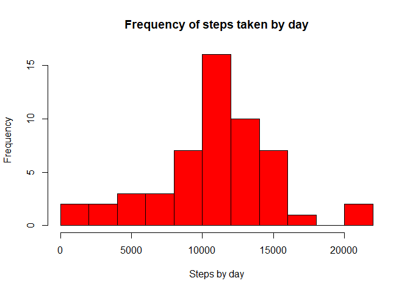
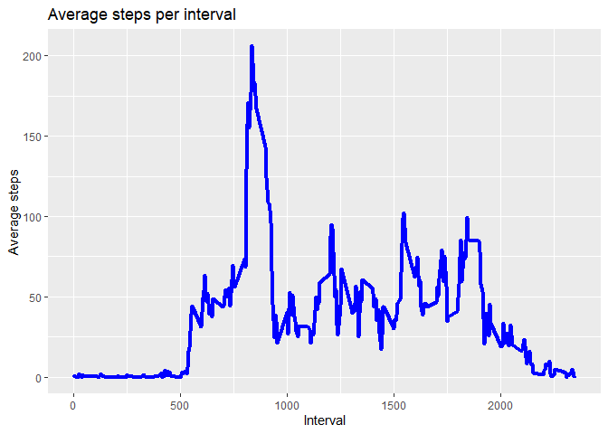
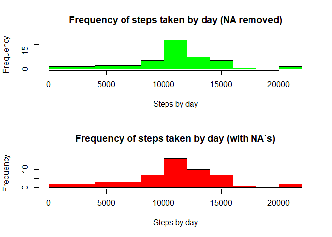
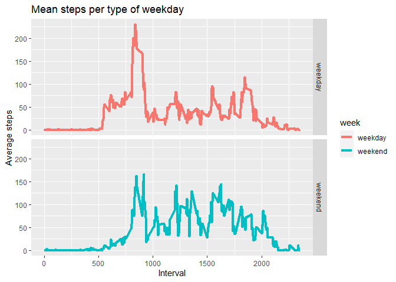

## Loading and preprocessing the data


```r
data <- read.csv("./data/activity.csv")
head(data)
```

```
##   steps       date interval
## 1    NA 2012-10-01        0
## 2    NA 2012-10-01        5
## 3    NA 2012-10-01       10
## 4    NA 2012-10-01       15
## 5    NA 2012-10-01       20
## 6    NA 2012-10-01       25
```

## What is mean total number of steps taken per day?

First, the calculation of steps per day

```r
steps_day <- tapply(data$steps, data$date, sum)
```

Making the histogram

```r
hist(steps_day, breaks = 10, xlab = "Steps by day", 
     main = "Frequency of steps taken by day", col = "red")
```

<!-- -->


```r
mean_steps <- mean(steps_day, na.rm = TRUE)
median_steps <- median(steps_day, na.rm = TRUE)
```
The mean number of steps is 1.0766189\times 10^{4} and the median is 10765


## What is the average daily activity pattern?

Separating by interval

```r
avg_interval <- aggregate(steps ~ interval,data = data, mean, na.rm = TRUE)
```

Making the plot

```r
library(ggplot2)
g <- ggplot(avg_interval, aes(interval, steps))
g + geom_line(size = 1.5, color = "blue") + 
        labs(x = "Interval", y = "Average steps", 
             title = "Average steps per interval")
```

<!-- -->


```r
max <- max(avg_interval$steps)
row_max <- which(avg_interval$steps == max)
max_steps <- avg_interval[row_max,1]
```
The interval with the highest average of steps is **835**

## Imputing missing values


```r
number_na <- which(is.na(data) == TRUE)
len <- length(number_na)
```
The total numbers of missing values is **2304**


Creating the new dataset without the missing values

```r
new_data <- data
mean_interval <- tapply(new_data$steps, new_data$interval, mean, na.rm=TRUE)
new_data$steps[number_na] <- mean_interval[as.character(new_data$interval[number_na])]

steps_day2 <- tapply(new_data$steps, new_data$date, sum)
```

Creating the histogram

```r
par(mfcol = c(2,1))
hist(steps_day2, breaks = 10, xlab = "Steps by day", col = "green",
          main = "Frequency of steps taken by day (NA removed)")

hist(steps_day, breaks = 10, xlab = "Steps by day", 
     main = "Frequency of steps taken by day (with NA´s)", col = "red")
```

<!-- -->


```r
mean_steps2 <- mean(steps_day2, na.rm = TRUE)
median_steps2 <- median(steps_day2, na.rm = TRUE)
```
The mean and median number of steps without removing the missing values is 1.0766189\times 10^{4} and 10765

The mean and median number of steps removing the missing values is 1.0766189\times 10^{4} and 1.0766189\times 10^{4}

As you can see, the difference is not very significant

## Are there differences in activity patterns between weekdays and weekends?

Creating the new factor variable


```r
new_data$date <- as.Date(new_data$date)

library(dplyr)
```

```
## 
## Attaching package: 'dplyr'
```

```
## The following objects are masked from 'package:stats':
## 
##     filter, lag
```

```
## The following objects are masked from 'package:base':
## 
##     intersect, setdiff, setequal, union
```

```r
new_data <- mutate(new_data, 
                   week = ifelse(weekdays(new_data$date) == "sábado" | 
                             weekdays(new_data$date) == "domingo",
                   "weekend", "weekday"))

new_data$week <- as.factor(new_data$week)
```

Making the graphic


```r
weekType_avg <- aggregate(steps ~ interval + week, data = new_data, mean)


g2 <- ggplot(weekType_avg, aes(interval, steps, color = week)) + 
        geom_line(size = 1.5) + 
        facet_grid(week~.) + labs(x = "Interval", y = "Average steps",
                                  title = "Mean steps per type of weekday")

g2
```

<!-- -->


